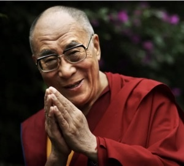

+++
title = "„Tibet ist in Vergessenheit geraten\" "
date = "2024-04-29"
draft = false
pinned = false
image = "9ae9ec02-87e2-4cb0-917d-d96d9dbf9849.png"
footnotes = "**Quellen:**\n\nhttps://www.bar.admin.ch\n\nhttps://freetibet-org.translate.goog/\n\nhttps://www.tfos.online\n\nhttps://www.fedlex.admin.ch"
+++
Seit der Machtübernahme Chinas in Tibet sind tausende Tibeter geflüchtet. Die 65-jährige Tendöl Namling ist in den 80er-Jahren in die Schweiz gekommen. Wie es sich im Exil lebt und welche Erfahrungen sie gemacht hat, erzählt sie beim Besuch in ihrem Laden in der Berner Altstadt.

Beim Betreten des kleinen, kompakten Ladens, welcher sich in der Berner Altstadt befindet, stösst den Besuchern ein dezenter Duft von Räucherstäbchen entgegen. In diesem kleinen Laden namens *Lhasa Boutique* wartet die Besitzerin Tendöl Namling. Während eine Kundin im Laden stöbert, mit ihrer Hand den Schmuck in die Hände nimmt und damit leichte Geräusche von sich gibt, nähert sich Tendöl. Sie ist 65 Jahre alt und hat zwei Kinder. Seit 42 Jahren lebt sie in der Schweiz und erzählt davon, was sie dazu bewegte, in die Schweiz zu kommen.

Im Jahre 1950 fand der Tibetkrieg statt, die Volksbefreiungsarmee der Volksrepublik China erlangte die Kontrolle über Tibet. Laut der Quelle *freetibet* kam es am 10. März 1959 zu einem Tibetischen Aufstand. In diesem Aufstand wurde gegen die Unterdrückung der chinesischen Besatzungsarmee protestiert. In der Hauptstadt Lhasa, versammelten sich Tausende Tibeter und umstellten den Potala-Palast. Sie befürchteten, dass der Dalai Lama in Gefahr sei. Sie wollten ihn beschützen. Durch den Protest, kamen Zehntausend Menschen ums Leben. Auch der Dalai-Lama musste ins Exil fliehen.

Am 17. März 1959 flüchtet der 24-jährige Dalai Lama mit mehreren Tausenden Tibetern nach Indien, darunter auch der Vater von Tendöl. Sie erzählt, dass sie ihren Vater deshalb noch nie gesehen habe. Der Vater ist nach der Flucht leider früh verstorben. Bevor Tendöl in die Schweiz kam, besuchte sie den Dalai Lama in Indien. Dazu merkt sie an, dass fast alle Tibeter nach Indien gehen, um den Dalai Lama zu sehen. Auch sie gehört zu denjenigen, die ihn in Indien sehen konnten. Laut Tendöl gibt er Rat und seine wertvolle Philosophie mit auf den Weg.



Dalai Lama

Der Dalai Lama ist das geistliche Oberhaupt der Buddhisten in Tibet. Aufgrund der politischen Lage in Tibet ist er mit tausenden weiteren Tibetern nach Indien geflüchtet. Dort kämpft er für die Menschenrechte und Frieden. Er gilt als hochangesehen, sodass viele Tibeter extra nach Indien reisen, um ihn zu sehen. Sein Name bedeutet so viel wie „Ozean der Weisheit".





Der sogenannte Potala-Palast in der Hauptstadt Lhasa ist der Regierungssitz des Dalai Lamas. Während der Machtübernahme in Tibet durch China diente der Palast vorwiegend als Unterkunft der chinesischen Armee. Heute gehört er zur Liste des UNSESCO-Welterbes.



Als Tendöl gefragt wird, wie sie in die Schweiz kam, erzählt sie, dass in den 80er Jahren die Kontrollen durch die Besatzer ein wenig gelockert wurden. So konnte sie Kontakt zu ihren Schwestern aufnehmen. Sie hatte bereits zwei Schwestern in der Schweiz, die sie bis dahin nicht kennenlernen konnte. Das Zusammentreffen der Schwestern fand im Kinderdorf Pestalozzi im Jahre 1982 statt. Mit ihrer Mutter zusammen flog Tendöl in die Schweiz mit einem chinesischen Pass und bemerkt dazu: ,,Alle Tibeter haben einen chinesischen Pass”. Früher konnten sich Tibeter in der Schweiz als ,,staatenlos“ oder mit ,,Tibet (Volksrepublik China)“ registrieren lassen. Im November 2014 entschied das Staatssekretariat für Migration (SEM), dass Asylsuchende aus Tibet nur noch mit Herkunft ,,China (Volksrepublik)“ registriert werden. 

**„Wir wurden gut in der Schweiz aufgenommen“**

Während des Tibetischen Aufstands flohen laut dem Schweizerischen Bundesarchiv insgesamt 80.000 Tibeterinnen und Tibeter aus Tibet. Sie wollten der Unterdrückung durch die chinesische Regierung entkommen. Im Oktober 1960 erreichten die ersten Flüchtlinge die Schweiz. In den folgenden Jahren kamen viele weitere Flüchtlinge dazu. Heute bilden sie in der Schweiz mit rund 3000 Personen die zweitgrösste tibetische Gemeinschaft ausserhalb Asiens.

**„Meine Religion gibt mir viel Kraft und Frieden“**

Die chinesische Regierung kontrolliert heute noch streng die religiösen Praktiken, dazu gehört die Beschränkung der Ausübung des Buddhismus. Die Tibetische Sprache und Kultur werden eingeschränkt, in den Schulen wird ausschliesslich Mandarin-Chinesisch gefördert. Eine freie Meinungsäusserung zu tätigen kommt nicht in Frage. Aktivisten, die sich für die tibetische Unabhängigkeit einsetzen, werden oft verhaftet und zu Gefängnisstrafen verurteilt. Laut Tendöl seien die Tibeter im eigenen Land eine Minderheit geworden. „Fast niemand kennt die Sprache. In Tibet wird fast nur Chinesisch gesprochen.” Schon nur, wenn man für den Dalai Lama bete, oder für die Freiheit, werde man verhaftet. Der grösste Unterschied zwischen der Schweiz und Tibet sei die Meinungsfreiheit. „Das ist der grösste Unterschied. Der grösste und schönste Unterschied.”

In der Schweiz kann Tendöl ihre Religion, den Buddhismus, frei ausleben und praktizieren. Seit fünf Jahren hört sie fast jeden Tag tibetische Philosophie-Podcasts. Jeden Morgen steht sie um fünf Uhr auf und hört diese Podcasts bis um sieben Uhr. Das löst in ihr ein gutes Gefühl von Kraft und Frieden aus. Laut Tendöl sei der Buddhismus eine Erfahrungsreligion und strebe das 

Ziel an, die Entwicklung des eigenen Geistes. Im Zentrum stehe kein Gott, sondern die Lehre der Lebensführung, die auf philosophischem Denken beruhe. Das tibetische Volk leide bis heute unter der chinesischen Besatzung. Trotz allem sei das Volk stark geblieben. Tendöl hat keinen Hass gegenüber den Chinesen, sondern empfindet Trauer. Sie fügt an, der Buddhismus sei Schicksal. Es sei ihr Schicksal und damit müsse sie positiv umgehen.

**Engagement im Exil**

Tendöl ist Mitglied in einer tibetischen Gemeinschaft in Bern. Gemeinsam mit ihrer Tochter und ihrem Sohn ist sie dort tätig. Sie erzählt, dass ihre beiden Kinder im Jugendverein seien, und sie sei in der Frauenorganisation. Am 5. November 1988 wurde die Tibetische Frauenorganisation in der Schweiz (TFOS) gegründet. Die Organisation verfolgt das folgende Ziel: Sich für Menschenrechte, Frieden und die Gerechtigkeit einsetzen. Ausserdem sollte die Organisation dazu dienen, den Kontakt unter den tibetischen Frauen zu fördern. Gleichzeitig mit der Gründung der Tibetischen Frauenorganisation wurde eine tibetische Tanzgruppe ins Leben gerufen. Sowohl die Frauenorganisation wie auch die Tanzgruppe möchten die tibetische Kultur ausserhalb des besetzen Tibets erhalten und an die nächsten Generationen weitergeben.

Im Jahre 1982 hat sich Tendöl entschieden, ihr Leben in der Schweiz weiterzuführen. Daraufhin stellt sie einen Asylantrag. Darin ist ihr Name wie in ihrem Reisepass geschrieben: Zhuoma, Danzen, chinesische Staatsangehörige. Die chinesische Regierung, konnte einerseits ihren tibetischen Namen nicht aussprechen, und anderseits hatte Tendöl Angst, ihren kritisierten tibetischen Familiennamen ,,Namseling“ anzugeben. In ihrem Asylverfahren muss Tendöl alles erzählen, was sie erlebt hat und über die aktuelle Situation in Tibet berichten. 1985 wurde Tendöl als Flüchtlingsfrau anerkannt und erhielt Asyl in der Schweiz. Heute hat Tendöl einen Schweizer Pass und sagt stolz dazu: „Ich habe viel daran gearbeitet“.

**Asylverfahren in der Schweiz**

Das Staatssekretariat für Migration (SEM) ist zuständig für die Durchführung des Asylverfahrens und regelt dabei, wer unter welchen Bedingungen in die Schweiz einreisen, arbeiten und leben darf.



Abkommen über die Rechtsstellung der Flüchtlinge, Artikel 1

A.  «Flüchtling» im Sinne dieses Abkommens ist jede Person,

lit. 2 

Laut der Quelle *fedlex.admin:* die sich... aus begründeter Furcht vor Verfolgung wegen ihrer Rasse, Religion, Staatszugehörigkeit, Zugehörigkeit zu einer bestimmten sozialen Gruppe oder wegen ihrer politischen Überzeugung ausserhalb ihres Heimatlandes befindet und dessen Schutz nicht beanspruchen kann oder wegen dieser Befürchtungen nicht beanspruchen will; oder die sich als Staatenlose infolge solcher Ereignisse ausserhalb ihres Wohnsitzstaates befindet und dorthin nicht zurückkehren kann oder wegen der erwähnten Befürchtungen nicht zurückkehren will.



\
Asylverfahren werden durchgeführt, um zu prüfen, ob die Vorbringen glaubhaft und die Kriterien für die Zuerkennung des Flüchtlingsstatus erfüllt sind. Wenn das Gesuch abgelehnt wird und auch keine vorläufige Aufnahme beispielsweise wegen medizinischen Gründen erteilt wird, müssen die Asylsuchenden die Schweiz wieder verlassen.

Menschen, die in ihrem Herkunftsland wegen ihrer Rasse, Nationalität, Religion, Zugehörigkeit zu einer sozialen Gruppe oder wegen ihrer politischen Überzeugungen verfolgt werden, können in der Schweiz Asyl erhalten. Asylgesuche werden in einem Bundesasylzentrum des SEM, das zuständig für die Durchführung der Asylverfahren ist, eingereicht. Die Identität muss dabei, wenn möglich mit offiziellen Dokumenten, belegt werden. 

Die Chefin der Abteilung Asylverfahren und Praxis des SEM erklärt, dass in den letzten Jahren immer weniger Personen aus Tibet in die Schweiz flüchten. Und nicht alle Asylgesuche von Tibeterinnen und Tibetern würden mit einem positiven Entscheid enden. Über 100 Tibeter leben in der Nothilfe oder als Sans-Papiers, weil ihr Asylgesuch abgelehnt worden sei. Oft werden die Asylgesuche abgelehnt, weil die Tibeterinnen und Tibetern in Indien oder Nepal längere Zeit gelebt haben und über beispielsweise indische Dokumente verfügen. Das SEM führe sogenannte LINGUA-Analysen durch. Mit diesen Herkunft- und Sprachanalysen werde geprüft, ob die betroffene Person glaubhaft machen kann, dass sie in Tibet sozialisiert worden sei. “Die Schweiz hat über Jahrzehnte hinweg, Tibeterinnen und Tibeter in der Schweiz willkommen geheissen. Die Solidarität ist gross. Ich würde mir dieselbe Solidarität und Grossherzigkeit für alle Flüchtlinge, egal aus welchem Herkunftsland und mit welcher Religion wünschen.”, sagt die Abteilungschefin. 

Auch wenn Tendöl für sich und ihre Familie ein neues Leben in der Schweiz aufgebaut hat, hat sie ihre Wurzeln in der fernen Heimat Tibet und steht zwischen zwei Welten. Ihre Kultur und Sprache wird sie an ihre Kinder weitergeben. Der Kampf für ein freies Tibet ist noch lange nicht zu Ende – doch die Tibeter haben es nicht leicht, ihrer Stimme in Tibet und im  Exil Gehör zu verschaffen.